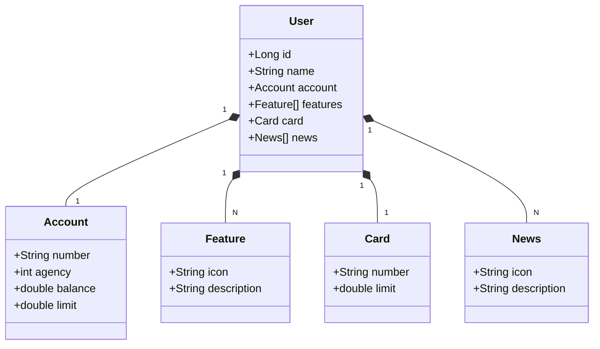

#Projetando para entrega no Desafio de Projeto
Java REST API represendando um contexto bancario.

##Diagrama de classes

```mermaid
classDiagram
    class User {
        +Long id
        +String name
        +Account account
        +Feature[] features
        +Card card
        +News[] news
    }

    class Account {
        +String number
        +int agency
        +double balance
        +double limit
    }

    class Feature {
        +String icon
        +String description
    }

    class Card {
        +String number
        +double limit
    }

    class News {
        +String icon
        +String description
    }

    User "1" * --  "1" Account 
    User "1" * -- "N" Feature
    User "1" * -- "1" Card 
    User "1" * -- "N" News
```
